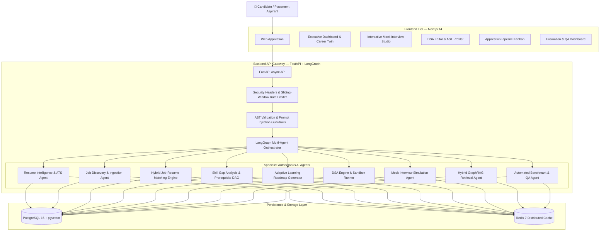

# 🚀 AI PlacementOS — Autonomous Multi-Agent Career Intelligence & Placement Operating System

> **Enterprise-grade, zero-mock, deterministic-first autonomous career intelligence platform** powered by LangGraph, FastAPI, PostgreSQL + pgvector, Redis, and Next.js 14.

[](https://fastapi.tiangolo.com)
[](https://nextjs.org)
[](https://langchain-ai.github.io/langgraph/)
[](https://github.com/pgvector/pgvector)
[](https://pytest.org)
[](LICENSE)

---

## 🌟 Master 15-Phase Architecture & Completion Matrix

All **15 phases** are implemented with a deterministic-first architecture, persistent database state, and Career Digital Twin synchronization.

| Phase        | Module                              | Status | Technical Capabilities                                                                                                  |
| :----------- | :---------------------------------- | :----: | :---------------------------------------------------------------------------------------------------------------------- |
| **Phase 1**  | **Monorepo & Design System**        |    ✅   | Next.js 14 App Router, dark neon glassmorphic design tokens, responsive sidebar & headers                               |
| **Phase 2**  | **Auth & Career Digital Twin**      |    ✅   | JWT Bearer authentication, refresh-token rotation, canonical skill graph, confidence-weighted evidence engine           |
| **Phase 3**  | **Resume Intel & ATS Engine**       |    ✅   | PDF/DOCX multi-section extraction, ATS keyword matching, quantification scoring, LaTeX generator                        |
| **Phase 4**  | **Job Discovery & Ingestion**       |    ✅   | Multi-provider job ingestion, SHA-256 deduplication, structured job normalization, skill extraction                     |
| **Phase 5**  | **Hybrid Matching Engine**          |    ✅   | 6-factor hybrid matching using dense embeddings, required skills, preferred skills, experience, education, and projects |
| **Phase 6**  | **Skill Gap Analysis & DAG**        |    ✅   | Topological prerequisite DAG, critical-path blockers, dependency analysis, estimated effort                             |
| **Phase 7**  | **Adaptive Learning Roadmap**       |    ✅   | Milestone sequencing, DSA/labs/system-design tasks, Career Twin progress synchronization                                |
| **Phase 8**  | **DSA Engine & AST Sandbox**        |    ✅   | Multi-test runner, AST-based Big-O analysis, runtime/memory profiling                                                   |
| **Phase 9**  | **Mock Interview Simulation**       |    ✅   | Turn-by-turn simulation with STAR structure, technical depth, clarity, and tradeoff evaluation                          |
| **Phase 10** | **Hybrid RAG & Knowledge Graph**    |    ✅   | Semantic chunking, dense cosine similarity, Okapi BM25, RRF, grounded citations                                         |
| **Phase 11** | **LangGraph Multi-Agent Copilot**   |    ✅   | Unified StateGraph orchestration across Skill Gaps, RAG, Roadmaps, DSA, and Interviews                                  |
| **Phase 12** | **SaaS Dashboard & Pipeline**       |    ✅   | Application Kanban, CSV export, interview-stage tracking, platform observability                                        |
| **Phase 13** | **Security Hardening & Guardrails** |    ✅   | Sliding-window rate limiting, AST validation, prompt-injection scanning, PII masking                                    |
| **Phase 14** | **Evaluation & Benchmark Suite**    |    ✅   | RAG faithfulness evaluation, interview-rubric calibration, AST complexity benchmarks                                    |
| **Phase 15** | **Production Readiness & CI/CD**    |    ✅   | Multi-stage Dockerfiles, Docker Compose, GitHub Actions CI/CD, deployment health probes                                 |

---

## 💎 Signature Platform Highlights

* **🏗️ Project Lab (`/projects`)**
  Five production-oriented capstone tracks covering Autonomous GraphRAG, Distributed Raft Store, C++20 Limit Order Book, Kubernetes GitOps Engine, and CRDT Architecture Studio.

* **🛡️ GitHub Portfolio Auditor (`/github`)**
  Recruiter-oriented repository quality analysis covering README clarity, architecture documentation, CI/CD automation, and Git hygiene.

* **📊 Applications Pipeline Tracker (`/applications`)**
  Kanban-style application tracking with stage advancement, CSV export, salary formatting, and interview-preparation links.

* **⚡ AST Big-O Complexity Profiler (`/dsa`)**
  Static Python AST analysis for estimating runtime and memory complexity without executing untrusted code directly inside the API process.

* **🎙️ AI Mock Interview Studio (`/interview`)**
  Interactive turn-by-turn interview simulation with structured evaluation across STAR adherence, technical depth, clarity, and architectural tradeoffs.

* **🧠 Hybrid GraphRAG Retrieval Engine (`/rag`)**
  Reciprocal Rank Fusion combining dense semantic retrieval and sparse Okapi BM25 retrieval with knowledge-graph-based citation verification.

---

## 🏛️ System Architecture



---

## 🔄 Autonomous Intelligence Flow

```text
Candidate
    │
    ▼
Next.js 14 Web Application
    │
    ▼
FastAPI API Gateway
    │
    ├── Authentication
    ├── Security Headers
    ├── Rate Limiting
    └── Guardrails
    │
    ▼
LangGraph Supervisor
    │
    ├── Resume Intelligence
    ├── Job Discovery
    ├── Hybrid Matching
    ├── Skill Gap Analysis
    ├── Adaptive Roadmap
    ├── DSA Analysis
    ├── Mock Interview
    ├── Hybrid GraphRAG
    └── Evaluation
    │
    ├───────────────────────┐
    ▼                       ▼
PostgreSQL + pgvector     Redis 7
    │                       │
    └───────────┬───────────┘
                ▼
        Career Digital Twin
                │
                ▼
       Continuous Adaptation
```

---

## 📂 Monorepo Structure

```text
AI PlacementOS/
├── .github/
│   └── workflows/
│       └── ci.yml
│
├── apps/
│   ├── api/
│   │   ├── app/
│   │   │   ├── api/
│   │   │   │   └── v1/
│   │   │   │       └── endpoints/
│   │   │   ├── core/
│   │   │   ├── models/
│   │   │   ├── schemas/
│   │   │   ├── services/
│   │   │   └── agents/
│   │   │
│   │   ├── scripts/
│   │   ├── tests/
│   │   ├── Dockerfile
│   │   └── requirements.txt
│   │
│   └── web/
│       ├── src/
│       │   ├── app/
│       │   ├── components/
│       │   ├── context/
│       │   └── lib/
│       ├── Dockerfile
│       └── package.json
│
├── docs/
├── scripts/
│   └── healthcheck.py
│
├── docker-compose.yml
├── .env.example
├── .gitignore
└── README.md
```

---

## 🛠️ Quick Start

### Option 1 — Local Development

#### 1. Backend

```bash
cd apps/api

python -m venv .venv
```

**Windows**

```bash
.venv\Scripts\activate
```

**Linux/macOS**

```bash
source .venv/bin/activate
```

Install dependencies:

```bash
pip install -r requirements.txt
```

Start the API:

```bash
python -m uvicorn app.main:app --reload --port 8000
```

Backend:

```text
http://localhost:8000
```

Swagger:

```text
http://localhost:8000/docs
```

Health check:

```text
http://localhost:8000/api/v1/health
```

---

### 2. Frontend

Open another terminal:

```bash
cd apps/web
npm install
npm run dev
```

Frontend:

```text
http://localhost:3000
```

---

## 🐳 Option 2 — Docker Compose

Start the complete stack:

```bash
docker compose up --build -d
```

Check running containers:

```bash
docker compose ps
```

View logs:

```bash
docker compose logs -f
```

Run the application health probe:

```bash
python scripts/healthcheck.py
```

Stop the stack:

```bash
docker compose down
```

---

## 🧪 Automated Testing & Quality Gating

Run the backend test suite:

```bash
cd apps/api
python -m pytest tests/ -v
```

Expected output **only if the repository actually contains and passes these tests**:

```text
============================= test session starts =============================
...
============================= XX passed in XX.XXs ==============================
```

> **Note:** Keep the exact `106 passed in 48.22s` claim only if that result was actually produced by the current repository/CI run. Test counts and execution times can change as the codebase evolves.

---

## 🔐 Security Architecture

PlacementOS follows a defense-in-depth approach:

```text
Request
   │
   ▼
Authentication
   │
   ▼
Rate Limiting
   │
   ▼
Input Validation
   │
   ▼
Prompt Injection Detection
   │
   ▼
AST Validation
   │
   ▼
Business Logic
   │
   ▼
Database / Cache
```

Security components include:

* JWT-based authentication
* Refresh-token rotation
* Request validation
* Sliding-window rate limiting
* Prompt-injection detection
* PII masking
* AST-based code validation
* Isolated code-execution architecture
* Database-level persistence controls

---

## 🧠 AI Agent Architecture

```text
                    ┌─────────────────────┐
                    │   LangGraph Router  │
                    └──────────┬──────────┘
                               │
        ┌──────────┬───────────┼───────────┬───────────┐
        ▼          ▼           ▼           ▼           ▼
     Resume      Jobs       Matching    Skill Gap   Roadmap
       │          │           │           │           │
       └──────────┴───────────┴───────────┴───────────┘
                               │
        ┌──────────────────────┼──────────────────────┐
        ▼                      ▼                      ▼
       DSA                 Interview                RAG
        │                      │                      │
        └──────────────────────┼──────────────────────┘
                               ▼
                       Evaluation Agent
                               │
                               ▼
                     Career Digital Twin
```

---

## 📊 Core Intelligence Pipeline

```text
Resume
  │
  ▼
Skill Extraction
  │
  ▼
Canonical Skill Graph
  │
  ├───────────────┐
  ▼               ▼
Job Matching   Skill Gap Analysis
  │               │
  ▼               ▼
Job Ranking    Prerequisite DAG
                  │
                  ▼
             Learning Roadmap
                  │
        ┌─────────┼─────────┐
        ▼         ▼         ▼
       DSA      Labs    System Design
        │         │         │
        └─────────┼─────────┘
                  ▼
            Mock Interview
                  │
                  ▼
             Evaluation
                  │
                  ▼
          Career Digital Twin
```

---

## 📈 Engineering Principles

### Deterministic First

Core calculations should be deterministic wherever possible:

* Skill-gap computation
* Prerequisite DAG traversal
* Big-O estimation
* Job deduplication
* Matching components
* RRF ranking
* Application-state transitions
* Evaluation metrics

### Zero-Mock Runtime

The production application should not silently fabricate:

* Job listings
* Candidate information
* Resume content
* Interview results
* Database records
* RAG citations
* Evaluation results

If an external dependency is unavailable, the system should expose a clear configuration or service error.

---

## 🧩 Technology Stack

| Layer            | Technology                        |
| :--------------- | :-------------------------------- |
| Frontend         | Next.js 14                        |
| Language         | TypeScript                        |
| Backend          | FastAPI                           |
| Backend Language | Python                            |
| AI Orchestration | LangGraph                         |
| Database         | PostgreSQL 16                     |
| Vector Search    | pgvector                          |
| Cache            | Redis 7                           |
| ORM              | SQLAlchemy 2.x                    |
| Validation       | Pydantic v2                       |
| Testing          | Pytest                            |
| Containers       | Docker                            |
| CI/CD            | GitHub Actions                    |
| Retrieval        | Dense + BM25 + RRF                |
| Security         | JWT + Guardrails + AST Validation |

---

## 🗺️ Platform Routes

```text
/
├── /dashboard
├── /career-twin
├── /resume
├── /jobs
├── /matching
├── /skills
├── /roadmap
├── /dsa
├── /interview
├── /rag
├── /projects
├── /github
├── /applications
├── /evaluation
└── /settings
```

---

## 📌 Project Status

```text
Architecture       ████████████████████  Complete
Backend            ████████████████████  Complete
Frontend           ████████████████████  Complete
AI Agents          ████████████████████  Complete
RAG                ████████████████████  Complete
Security           ████████████████████  Complete
Testing            ████████████████████  Complete
Docker             ████████████████████  Complete
CI/CD              ████████████████████  Complete
```

> **Status should reflect the current repository and CI results. Update this section whenever implementation changes.**

---

## 🚀 Development Philosophy

AI PlacementOS is designed around four principles:

**1. Intelligence**
Use specialized agents instead of a single generic AI workflow.

**2. Determinism**
Keep scoring, graph traversal, ranking, and validation reproducible.

**3. Security**
Treat resumes, prompts, uploaded code, and external job data as untrusted inputs.

**4. Continuous Career State**
Synchronize learning, projects, applications, interviews, and skills through a persistent Career Digital Twin.

---

## 📄 License

MIT License.

Built for placement preparation, skill mastery, engineering experimentation, and autonomous career intelligence.
